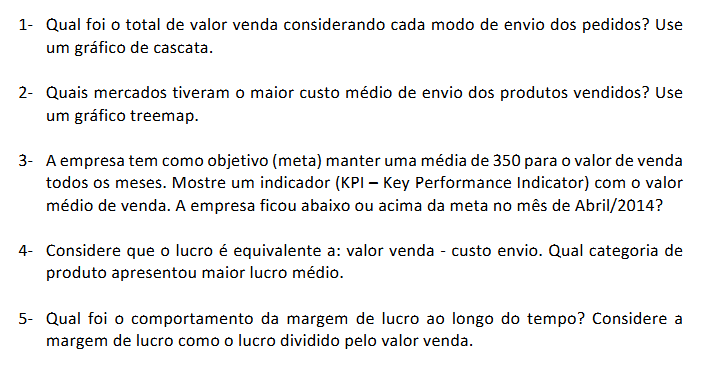
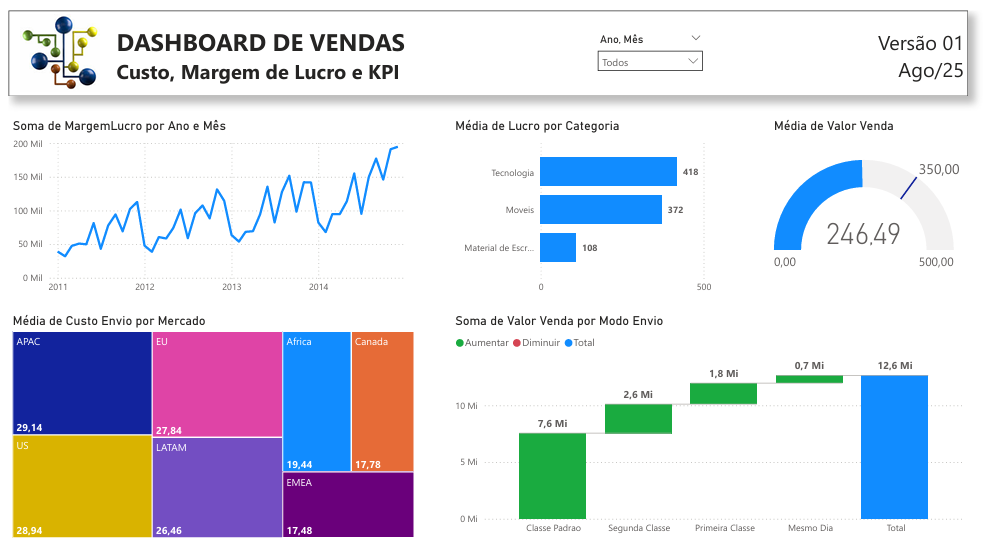

# Laboratório Prático 2 - Dashboard de Vendas, Custo, Margem de lucro e KPI
Projeto do curso: "Microsoft Power BI Para Business Intelligence e Data Science", por [Data Science Academy](www.datascienceacademy.com.br).

## Sobre o Dataset
Gerar insights para o negócio com foco em: Vendas, Custo, Margem de Lucro.   
04 datasets disponibilizados neste projeto:  
- Clientes.csv
- Pedidos.csv
- Produtos.csv
- Vendas.csv

## Perguntas

## Dataviz
_Em desenvolvimento_

 

[Ver Dashboard online.](https://app.powerbi.com/view?r=eyJrIjoiMzE2NDM2NWUtMjQ0ZS00N2ZkLWIwMjEtYmZjZDcxOGUxMzE5IiwidCI6IjY1OWNlMmI4LTA3MTQtNDE5OC04YzM4LWRjOWI2MGFhYmI1NyJ9)

[End]